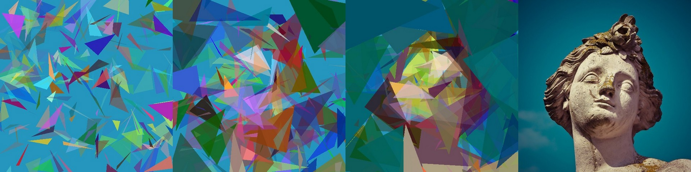
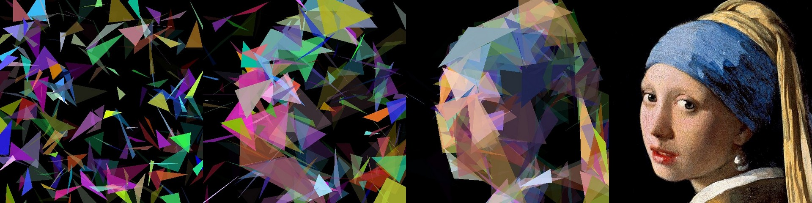
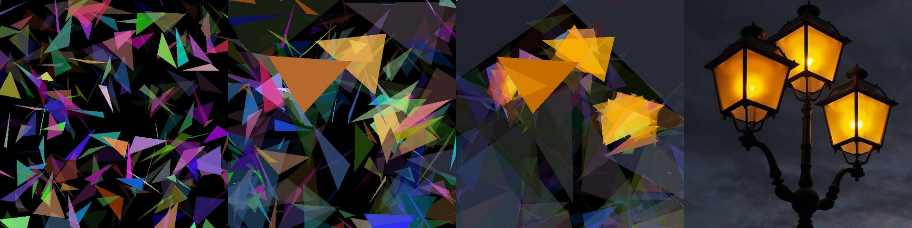
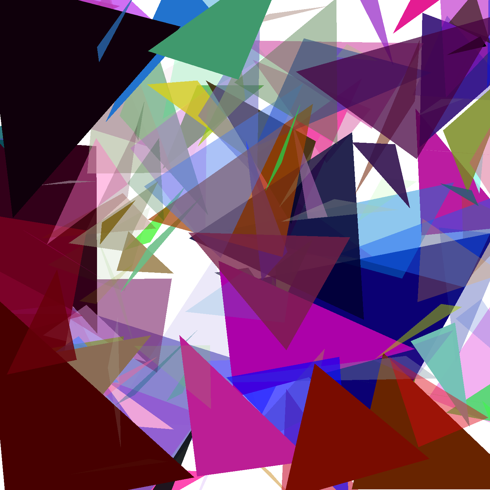

Assignment 2 Report: AI Art

# Assignment 2 Report: AI Art

Basically: Recreate Images From Triangles

## What is a chromosome's representation?

```python
class Chromosome:
    def __init__(self, painting: Painting):
        self.painting = painting
        self.fitness = score(self.painting)

    def set_fitness(self, fitness):
        self.fitness = fitness

    def get_score(self):
        return self.fitness

    def calculate_fitness(self):
        self.fitness = score(self.painting)
```

My Chomosome's representation is a class that contains a "painting", which is a data structure consisting of a predefined base (background) created by a fixed number of triangles (genes) and a fitness score. The fitness score is calculated right after instantiation.

The size of the painting is the same size as the target image

## Population Size and Selection technique

Population Size: Started with 100 chromosomes but I find the algorithm gets stuck to at local maximum after roughly 80 generations. After increasing the population to 250, the gain still exists after roughly 200 generations. I decided to optimize the mutation rate and keep a 100 chromosome population.

Selection method: At first, I select the top 2 with the lowest fitness score (I'm minimizing the difference) to repopulate the population but got stuck again in a local maximum, the gain stopped showing after 15 generations. Afterward, I select the best and one random chromosome in the population (they both survive the elimination round)

## The Fitness Function
The fitness function is the histogram difference from the target image.

## How crossover/mutation is done
**Crossover:** Two "painting" is chosen, one best, one random, the child inherit half of the gene (triangle) from each of the chosen parents.

**Mutation:** A number of the triangles (genes) in a chromosome will be reset to their original position, change color, and change position based on 2 input arguments.

## Results
**Test Images are the ones furthest to the right.**

From left to right: 1, 700, 1400 generations. Roughly 2 hours to completely "evolve" 1400 generations for each picture, I stopped at 1400 generations.











## Further Comment





**Girl With Pearl, 287 generations**

I tried experimenting with different survival/mutation rates, with survival rate less than **20%** and **61% mutation rate**, the solutions quickly converge to local maximum and there was no gain after roughly 280 generations.

I found success with **60% survival rate** and mutate all 40% of the offsprings, in the later stage of the program, gains appear within roughly every 12 generations.

## Running the code

1. To run the code in this repository clone it, set up a virtual environment and install the required packages from requirements.txt

```bash

git clone https://github.com/pierrepicaud/recreate_images_from_triangle.git
cd recreate_images_from_triangle
python -m venv venv
source venv/bin/activate
pip install -r requirements.txt

```

2. Put the image you want to simulate in the ".\img\" folder, and change the `target_image_path` in `main.py`

3. Run main.py using

```bash

python main.py

```

The paths to the target image and output directory are hard-coded, but can easily be changed. the lines are in the main
routine.

```python
    target_image_path = "./image/lamp.png"
    checkpoint_path = "./output/"
```


## Credit
I took the `Triangle` class and the `Painting` class from [here](https://github.com/4dcu-be/Genetic-Art-Algorithm.git) and implemented the genetic algorithm myself, which is the whole point of this assignment.
